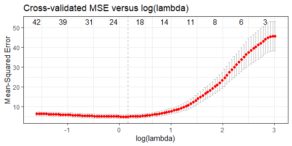
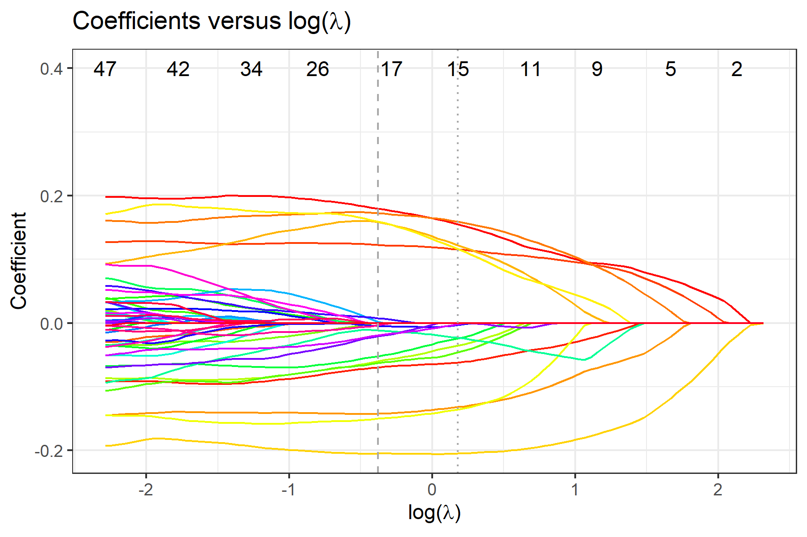

<!-- README.md is generated from README.Rmd. Please edit that file -->

# FLORAL: Fit LOg-RAtio Lasso regression for compositional covariates 

<!-- badges: start -->

[](https://github.com/vdblab/FLORAL/actions/workflows/R-CMD-check.yaml)
[](https://cran.r-project.org/package=FLORAL)
[](https://cran.r-project.org/package=FLORAL)
[](https://cran.r-project.org/package=FLORAL)
<!-- badges: end -->

The `FLORAL` package is an open-source computational tool to perform
log-ratio lasso regression modeling and compositional feature selection
for continuous, binary, time-to-event, and competing risk outcomes. The
proposed method adapts the augmented Lagrangian algorithm for a zero-sum
constraint optimization problem while enabling a two-stage screening
process for extended false-positive control.

The associated article for `FLORAL` is available on
[Cell Reports Methods](https://doi.org/10.1016/j.crmeth.2024.100899).

## System requirements and installation

The current version of `FLORAL` (0.4.0) was built in R version 4.4.2. R
package dependencies can be found in the `DESCRIPTION` file.

You can install `FLORAL` with the following code. The installation is
typically complete within minutes.

``` r
install.packages("FLORAL")
```

You can install the development version of `FLORAL` from
[GitHub](https://github.com/) with:

``` r
# install.packages("devtools")
devtools::install_github("vdblab/FLORAL")
```

## Example

Here is a toy example for linear regression with 10-fold
cross-validation for a simulated data with 50 samples and 100
compositional features. Option `progress=TRUE` can be used to show the
progress bar of the running algorithm.

The data simulation procedure is described in the preprint. The expected
run time for the following demo is about a minute.

``` r
set.seed(23420)
library(FLORAL)

dat <- simu(n=50,p=100,model="linear")
fit <- FLORAL(dat$xcount,dat$y,family="gaussian",ncv=10,progress=FALSE)
```

To view plots of cross-validated prediction error and parameter
coefficients, use `fit$pmse` or `fit$pcoef`:



To view selected compositional features, use `fit$selected.feature`,
where features are sorted by their names. Features under `min` and `1se`
correspond to penalty parameter $\lambda_{\min}$ and
$\lambda_{\text{1se}}$, respectively. Features under `min.2stage` and
`1se.2stage` are obtained after applying 2-stage filtering based on
features under `min` and `1se`, respectively.

We recommend interpreting the selected compositional features as
potential predictive markers to the outcome in the regression model in
the sense that the cross-validated prediction error is improved by
considering these selected features.

``` r
fit$selected.feature
#> $min
#>  [1] "taxa1"  "taxa10" "taxa13" "taxa2"  "taxa20" "taxa3"  "taxa32" "taxa39"
#>  [9] "taxa5"  "taxa6"  "taxa60" "taxa7"  "taxa75" "taxa76" "taxa79" "taxa8" 
#> [17] "taxa84" "taxa9"  "taxa92"
#> 
#> $`1se`
#>  [1] "taxa1"  "taxa10" "taxa13" "taxa2"  "taxa20" "taxa3"  "taxa32" "taxa39"
#>  [9] "taxa5"  "taxa6"  "taxa7"  "taxa75" "taxa8"  "taxa84" "taxa9" 
#> 
#> $min.2stage
#>  [1] "taxa1"  "taxa10" "taxa13" "taxa2"  "taxa20" "taxa3"  "taxa32" "taxa5" 
#>  [9] "taxa6"  "taxa60" "taxa7"  "taxa79" "taxa8"  "taxa84" "taxa9"  "taxa92"
#> 
#> $`1se.2stage`
#>  [1] "taxa1"  "taxa10" "taxa13" "taxa2"  "taxa20" "taxa3"  "taxa32" "taxa5" 
#>  [9] "taxa6"  "taxa7"  "taxa8"  "taxa84" "taxa9"
```

To get specific log-ratios selected by the 2-stage procedure, use
`fit$step2.log-ratios`, where `min` and `1se` display the log-ratios
between features. For each identified ratio, `min.idx` and `1se.idx`
return the column indices in the original input matrix for the two
corresponding features forming the ratio.

``` r
fit$step2.ratios
#> $min
#>  [1] "taxa1/taxa13" "taxa1/taxa20" "taxa1/taxa84" "taxa2/taxa5"  "taxa3/taxa8" 
#>  [6] "taxa3/taxa92" "taxa5/taxa8"  "taxa6/taxa9"  "taxa7/taxa10" "taxa7/taxa79"
#> [11] "taxa8/taxa60" "taxa9/taxa32" "taxa9/taxa92"
#> 
#> $`1se`
#>  [1] "taxa1/taxa13" "taxa1/taxa20" "taxa1/taxa84" "taxa2/taxa5"  "taxa3/taxa8" 
#>  [6] "taxa5/taxa8"  "taxa6/taxa7"  "taxa6/taxa9"  "taxa7/taxa10" "taxa9/taxa32"
#> 
#> $min.idx
#>      [,1] [,2] [,3] [,4] [,5] [,6] [,7] [,8] [,9] [,10] [,11] [,12] [,13] [,14]
#> [1,]   NA    1    1    1    2    3    3    5    6     7     7     8     9     9
#> [2,]   NA   13   20   84    5    8   92    8    9    10    79    60    32    92
#> 
#> $`1se.idx`
#>      [,1] [,2] [,3] [,4] [,5] [,6] [,7] [,8] [,9] [,10] [,11]
#> [1,]   NA    1    1    1    2    3    5    6    6     7     9
#> [2,]   NA   13   20   84    5    8    8    7    9    10    32
```

More detailed interpretations can be obtained for the selected
log-ratios. First, the selected log-ratios also improve the
cross-validated prediction errors because these log-ratios are derived
from the constrained lasso estimate. Moreover, as guided by the
association table between log-ratios and the outcome, it is possible to
interpret the directions of the covariate effects associated with
certain log-ratios on the outcome. To view detailed associations between
selected log-ratios and the outcome, use `fit$step2.tables` to print
summary tables for the multivariable stepwise regression models obtained
by the 2-stage procedure.

``` r
fit$step2.tables$min
```

``` r
fit$step2.tables$`1se`
```

For binary and survival outcomes, please specify `family="binomial"`,
`family="cox"`, or `family="finegray"` accordingly.

``` r
dat.bin <- simu(n=50,p=100,model="binomial")
fit.bin <- FLORAL(dat.bin$xcount,dat.bin$y,family="binomial",ncv=10,progress=FALSE)

dat.cox <- simu(n=50,p=100,model="cox")
fit.cox <- FLORAL(dat.cox$xcount,survival::Surv(dat.cox$t,dat.cox$d),family="cox",ncv=10,progress=FALSE)

dat.fg <- simu(n=50,p=100,model="finegray")
fit.fg <- FLORAL(dat.cox$xcount,survival::Surv(dat.cox$t,dat.cox$d,type="mstate"),family="finegray",ncv=10,progress=FALSE,step2=FALSE)
```

## Repository for Reproducibility

Reproducible code for the analyses results reported in the manuscript
can be found at [this
repository](https://github.com/vdblab/FLORAL-analysis).

## Contributing

The `FLORAL` package is jointly managed by [MSKCC Biostatistics
service](https://www.mskcc.org/departments/epidemiology-biostatistics/biostatistics)
and [the Marcel van den Brink Lab](https://www.cityofhope.org/research/hematologic-malignancies-research-institute/marcel-van-den-brink-lab). Please
note that the `FLORAL` project is released with a [Contributor Code of
Conduct](https://github.com/vdblab/FLORAL/blob/master/.github/CODE_OF_CONDUCT.md).
By contributing to this project, you agree to abide by its terms. Thank
you to all contributors!

## Reference

Fei T, Funnell T, Waters NR, Raj SS, Sadeghi K, Dai A, Miltiadous O,
Shouval R, Lv M, Peled JU, Ponce DM, Perales M-A, Gönen M, van den Brink
MRM, Scalable log-ratio lasso regression for enhanced microbial feature selection with FLORAL, Cell Reports Methods (2024), 100899; doi:
<https://doi.org/10.1016/j.crmeth.2024.100899>.
