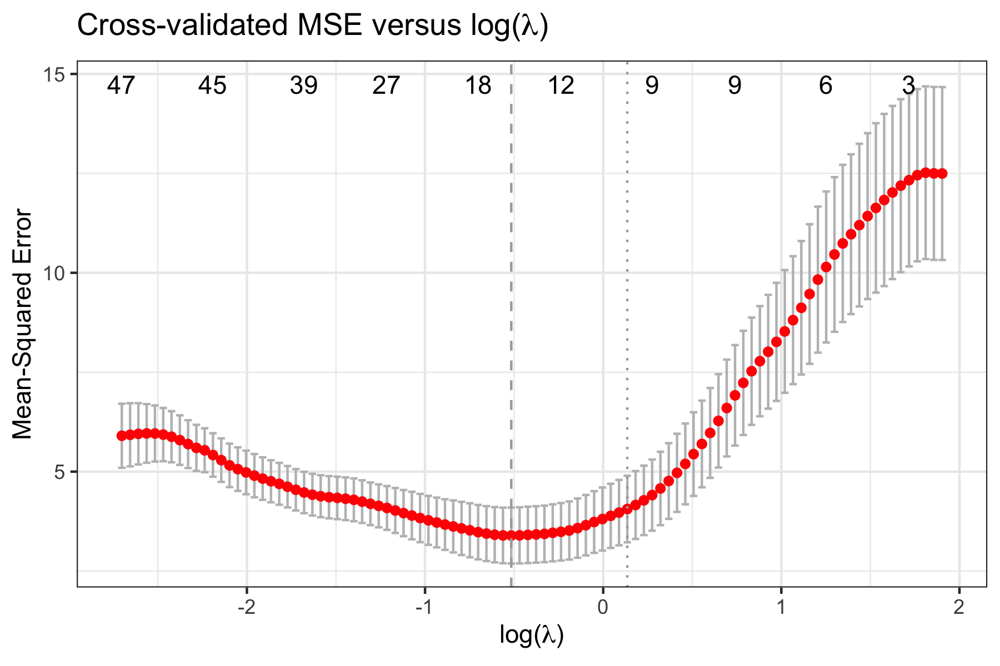
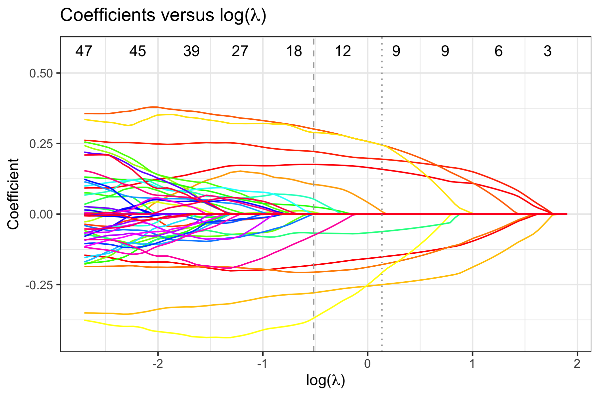

<!-- README.md is generated from README.Rmd. Please edit that file -->

# FLORAL: Fit LOg-RAtio Lasso regression for compositional covariates

<!-- badges: start -->

[](https://github.com/vdblab/FLORAL/actions/workflows/R-CMD-check.yaml)
[](https://app.codecov.io/gh/vdblab/FLORAL?branch=master)
<!-- badges: end -->

`FLORAL` is an open-source computational tool to perform log-ratio lasso
regression modeling and microbial feature selection for continuous,
binary, time-to-event, and competing risk outcomes. The proposed method
adapts the augmented Lagrangian algorithm for a zero-sum constraint
optimization problem while enabling a two-stage screening process for
extended false-positive control.

## Installation

You can install the development version of `FLORAL` from
[GitHub](https://github.com/) with:

``` r
# install.packages("devtools")
devtools::install_github("vdblab/FLORAL")
```

## Example

Here is a toy example for linear regression with 10-fold
cross-validation for a simulated data with 50 samples and 100
compositional features.

The data simulation procedure is described in the preprint.

``` r
set.seed(23420)
library(FLORAL)

dat <- simu(n=50,p=100,model="linear")
fit <- FLORAL(dat$xcount,dat$y,family="gaussian",ncv=10,progress=FALSE)
```

To view plots of cross-validated prediction error and parameter
coefficients, use `fit$pmse` or `fit$pcoef`:



To view selected compositional features, use `fit$selected.feature`,
where features are sorted by their names. Features under `min` and `1se`
correspond to penalty parameter *λ*<sub>min</sub> and *λ*<sub>1se</sub>,
respectively. Features under `min.2stage` and `1se.2stage` are obtained
after applying 2-stage filtering based on features under `min` and
`1se`, respectively.

``` r
fit$selected.feature
#> $min
#>  [1] "taxa1"  "taxa10" "taxa13" "taxa2"  "taxa20" "taxa3"  "taxa32" "taxa39"
#>  [9] "taxa5"  "taxa6"  "taxa60" "taxa7"  "taxa75" "taxa76" "taxa79" "taxa8" 
#> [17] "taxa84" "taxa9"  "taxa92"
#> 
#> $`1se`
#>  [1] "taxa1"  "taxa10" "taxa13" "taxa2"  "taxa20" "taxa3"  "taxa32" "taxa39"
#>  [9] "taxa5"  "taxa6"  "taxa7"  "taxa75" "taxa8"  "taxa84" "taxa9" 
#> 
#> $min.2stage
#>  [1] "taxa1"  "taxa10" "taxa13" "taxa2"  "taxa20" "taxa3"  "taxa32" "taxa5" 
#>  [9] "taxa6"  "taxa60" "taxa7"  "taxa79" "taxa8"  "taxa84" "taxa9"  "taxa92"
#> 
#> $`1se.2stage`
#>  [1] "taxa1"  "taxa10" "taxa13" "taxa2"  "taxa20" "taxa3"  "taxa32" "taxa5" 
#>  [9] "taxa6"  "taxa7"  "taxa8"  "taxa84" "taxa9"
```

To get specific ratios selected by the 2-stage procedure, use
`fit$step2.ratios`, where `min` and `1se` display the ratios between
features. For each identified ratio, `min.idx` and `1se.idx` return the
column indices in the original input matrix for the two corresponding
features forming the ratio.

``` r
fit$step2.ratios
#> $min
#>  [1] "taxa1/taxa13" "taxa1/taxa20" "taxa1/taxa84" "taxa2/taxa5"  "taxa3/taxa8" 
#>  [6] "taxa3/taxa92" "taxa5/taxa8"  "taxa6/taxa9"  "taxa7/taxa10" "taxa7/taxa79"
#> [11] "taxa8/taxa60" "taxa9/taxa32" "taxa9/taxa92"
#> 
#> $`1se`
#>  [1] "taxa1/taxa13" "taxa1/taxa20" "taxa1/taxa84" "taxa2/taxa5"  "taxa3/taxa8" 
#>  [6] "taxa5/taxa8"  "taxa6/taxa7"  "taxa6/taxa9"  "taxa7/taxa10" "taxa9/taxa32"
#> 
#> $min.idx
#>      [,1] [,2] [,3] [,4] [,5] [,6] [,7] [,8] [,9] [,10] [,11] [,12] [,13]
#> [1,]    1    1    1    2    3    3    5    6    7     7     8     9     9
#> [2,]   13   20   84    5    8   92    8    9   10    79    60    32    92
#> 
#> $`1se.idx`
#>      [,1] [,2] [,3] [,4] [,5] [,6] [,7] [,8] [,9] [,10]
#> [1,]    1    1    1    2    3    5    6    6    7     9
#> [2,]   13   20   84    5    8    8    7    9   10    32
```

For binary and survival outcomes, please specify `family="binomial"` and
`family="cox"` accordingly.

``` r
dat.bin <- simu(n=50,p=100,model="binomial")
fit.bin <- FLORAL(dat.bin$xcount,dat.bin$y,family="binomial",ncv=10,progress=FALSE)

dat.cox <- simu(n=50,p=100,model="cox")
fit.cox <- FLORAL(dat.cox$xcount,survival::Surv(dat.cox$t,dat.cox$d),family="cox",ncv=10,progress=FALSE)
```
