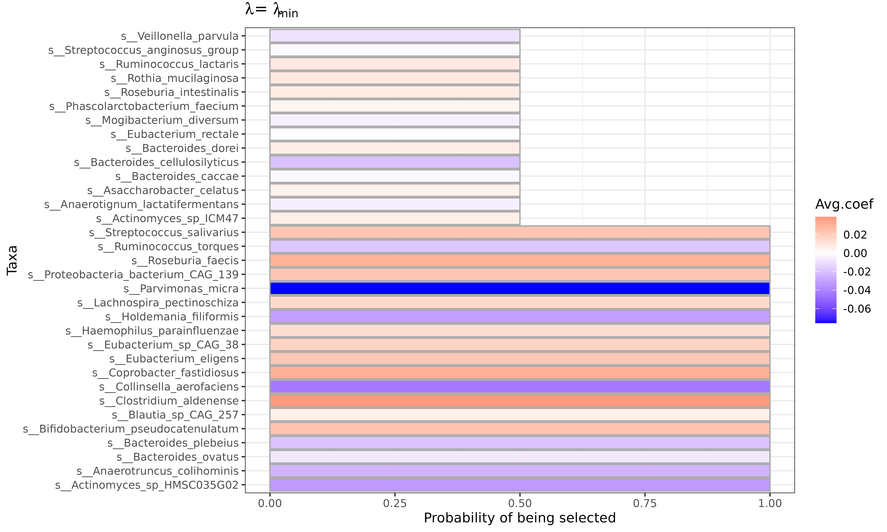
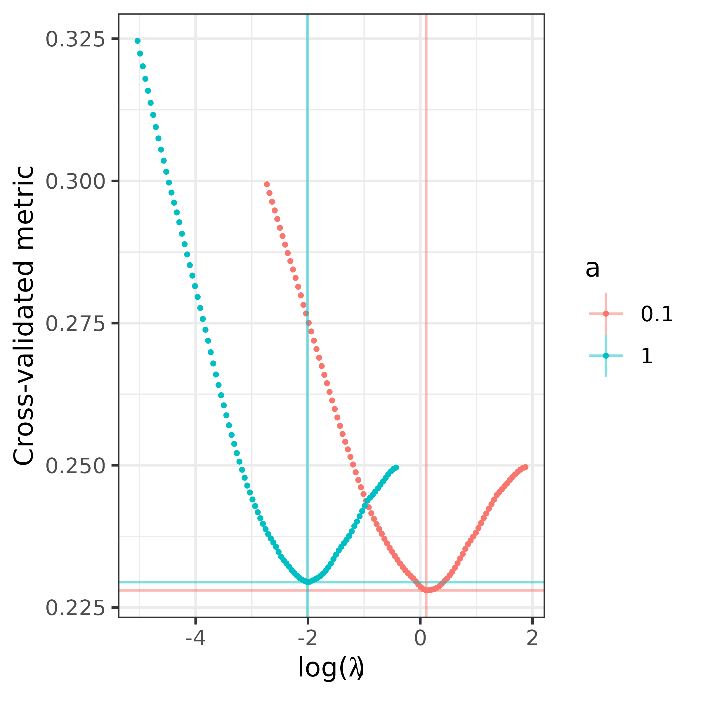

# Using FLORAL for Microbiome Analysis

``` r
library(FLORAL)
library(dplyr)
library(patchwork)
```

## Data

We will be using data from the `curatedMetagenomicData` package. For
easier installation, we saved a flat copy of the data, but the steps
below show how that was created.

``` r
if (! "BiocManager" %in% installed.packages()) install.packages("BiocManager")
if (! "curatedMetagenomicData" %in% installed.packages()) BiocManager::install("curatedMetagenomicData")
if (! "patchwork" %in% installed.packages()) install.packages("patchwork")
library(curatedMetagenomicData)

# Take a look at the summary of the studies available:
curatedMetagenomicData::sampleMetadata  |> group_by(.data$study_name, .data$study_condition) |> count() |> arrange(.data$study_name) 
#As an example, let us look at the `YachidaS_2019` study between healthy controls and colorectal cancer (CRC) patients.
curatedMetagenomicData::curatedMetagenomicData("YachidaS_2019") 
# note --  if you are behind a firewall, see the solutions to 500 errors here:
# https://support.bioconductor.org/p/132864/
rawdata <- curatedMetagenomicData::curatedMetagenomicData("2021-03-31.YachidaS_2019.relative_abundance", dryrun = FALSE, counts = TRUE) |>  mergeData()
x <- SummarizedExperiment::assays(rawdata)$relative_abundance %>% t()
y <- rawdata@colData$disease

save(list = c("x", "y"),  file = file.path("inst", "extdata", "YachidaS_2019.Rdata"))
```

``` r
load(system.file("extdata", "YachidaS_2019.Rdata", package="FLORAL"))
```

## Running FLORAL

We extracted the data from the `TreeSummarizedExperiment` object to two
objects: the taxa matrix `x` and the “outcomes” vector `y` of whether a
patient is healthy or has colorectal cancer (CRC). Note that for binary
outcomes, the input vector `y` needs to be formatted with entries equal
to either `0` or `1`. In addition, we need to specify
`family = "binomial"` in `FLORAL` to fit the logistic regression model.
To print the progress bar as the algorithm runs, please use
`progress = TRUE`.

``` r

x <- x[y %in% c("CRC","healthy"),]
x <- x[,colSums(x >= 100) >= nrow(x)*0.2] # filter low abundance taxa

colnames(x) <- sapply(colnames(x), function(x) strsplit(x,split="[|]")[[1]][length(strsplit(x,split="[|]")[[1]])])

y <- as.numeric(as.factor(y[y %in% c("CRC","healthy")]))-1
fit <- FLORAL(x = x, y = y, family="binomial", ncv=10, progress=TRUE)
#> Using elastic net with a=1.Algorithm running for full dataset: 
#> Algorithm running for cv dataset 1 out of 10: 
#> Algorithm running for cv dataset 2 out of 10: 
#> Algorithm running for cv dataset 3 out of 10: 
#> Algorithm running for cv dataset 4 out of 10: 
#> Algorithm running for cv dataset 5 out of 10: 
#> Algorithm running for cv dataset 6 out of 10: 
#> Algorithm running for cv dataset 7 out of 10: 
#> Algorithm running for cv dataset 8 out of 10: 
#> Algorithm running for cv dataset 9 out of 10: 
#> Algorithm running for cv dataset 10 out of 10:
```

## Interpreting the Model

FLORAL, like other methods that have an optimization step, has two
“best” solutions for $\lambda$ available: one minimizing the mean
squared error ($\lambda_{\min}$), and one maximizing the value of
$\lambda$ withing 1 standard error of the minimum mean squared error
($\lambda_{\text{1se}}$). These are referred to as the `min` and `1se`
solutions, respectively.

We can see the mean squared error (MSE) and the coefficients vs
log($\lambda$) as follows:

``` r
fit$pmse + fit$pcoef
```


In both plots, the vertical dashed line and dotted line represent
$\lambda_{\min}$ and $\lambda_{\text{1se}}$, respectively. In the MSE
plot, the bands represent plus minus one standard error of the MSE. In
the coefficient plot, the colored lines represent individual taxa, where
taxa with non-zero values at $\lambda_{\min}$ and $\lambda_{\text{1se}}$
are selected as predictive of the outcome.

To view specific names of the selected taxa, please see
`fit$selected.feature$min` or `fit$selected.feature$1se` vectors. To
view all coefficient estimates, please see `fit$best.beta$min` or
`fit$best.beta$1se`. Without looking into ratios, one can crudely
interpret positive or negative association between a taxon and the
outcome by the positive or negative sign of the coefficient estimates.
However, we recommend referring to the two-step procedure discussed
below for a more rigorous interpretation based on ratios, which is
derived from the log-ratio model assumption.

``` r

head(fit$selected.feature$min)
#> [1] "s__Actinomyces_sp_HMSC035G02"      "s__Actinomyces_sp_ICM47"          
#> [3] "s__Anaerotignum_lactatifermentans" "s__Anaerotruncus_colihominis"     
#> [5] "s__Asaccharobacter_celatus"        "s__Bacteroides_caccae"

head(sort(fit$best.beta$min))
#>             s__Parvimonas_micra      s__Collinsella_aerofaciens 
#>                     -0.07868135                     -0.04559018 
#>    s__Actinomyces_sp_HMSC035G02        s__Holdemania_filiformis 
#>                     -0.04128899                     -0.03473013 
#>    s__Anaerotruncus_colihominis s__Bacteroides_cellulosilyticus 
#>                     -0.02883898                     -0.02154445
```

## The Two-step Procedure

In the previous section, we checked the lasso estimates without
identifying specific ratios that are predictive of the outcome (CRC in
this case). By default, `FLORAL` performs a two-step selection procedure
to use `glmnet` and `step` regression to further identify taxa pairs
which form predictive log-ratios. To view those pairs, use
`fit$step2.ratios$min` or `fit$step2.ratios$1se` for names of ratios and
`fit$step2.ratios$min.idx` or `fit$step2.ratios$1se.idx` for the pairs
of indices in the original input count matrix `x`. Note that one taxon
can occur in multiple ratios.

``` r

head(fit$step2.ratios$`1se`)
#> [1] "s__Bacteroides_plebeius/s__Roseburia_faecis"                    
#> [2] "s__Eubacterium_eligens/s__Bacteroides_cellulosilyticus"         
#> [3] "s__Collinsella_aerofaciens/s__Bifidobacterium_pseudocatenulatum"
#> [4] "s__Collinsella_aerofaciens/s__Coprobacter_fastidiosus"          
#> [5] "s__Streptococcus_salivarius/s__Parvimonas_micra"                
#> [6] "s__Holdemania_filiformis/s__Eubacterium_sp_CAG_38"

fit$step2.ratios$`1se.idx`
#>      [,1] [,2] [,3] [,4] [,5] [,6] [,7] [,8] [,9] [,10]
#> [1,]   NA    1    4   12   12   22   27   27   64    73
#> [2,]   NA   81  113  102  114  131   90  151  131    80
```

To further interpret the positive or negative associations between the
outcome, please refer to the output `step` regression tables, where the
effect sizes of the ratios can be found.

While the corresponding p-values are also available, we recommend only
using the p-values as a criterion to rank the strength of the
association. We do not recommend directly reporting the p-values for
inference, because these p-values were obtained after running the first
step lasso model without rigorous post-selective inference. However, it
is still valid to claim these selected log-ratios are predictive of the
outcome, as demonstrated by the improved 10-fold cross-validated
prediction errors.

``` r

fit$step2.tables$`1se`
#>                                                                    Estimate
#> (Intercept)                                                     -0.27768687
#> s__Bacteroides_plebeius/s__Roseburia_faecis                     -0.03017163
#> s__Eubacterium_eligens/s__Bacteroides_cellulosilyticus           0.04757745
#> s__Collinsella_aerofaciens/s__Bifidobacterium_pseudocatenulatum -0.03155717
#> s__Collinsella_aerofaciens/s__Coprobacter_fastidiosus           -0.04228961
#> s__Streptococcus_salivarius/s__Parvimonas_micra                  0.07442538
#> s__Holdemania_filiformis/s__Eubacterium_sp_CAG_38               -0.04151069
#> s__Holdemania_filiformis/s__Proteobacteria_bacterium_CAG_139    -0.03977612
#> s__Clostridium_aldenense/s__Parvimonas_micra                     0.07865537
#> s__Lachnospira_pectinoschiza/s__Ruminococcus_torques             0.03308018
#>                                                                 Std. Error
#> (Intercept)                                                     0.21517691
#> s__Bacteroides_plebeius/s__Roseburia_faecis                     0.01108305
#> s__Eubacterium_eligens/s__Bacteroides_cellulosilyticus          0.01352613
#> s__Collinsella_aerofaciens/s__Bifidobacterium_pseudocatenulatum 0.01570154
#> s__Collinsella_aerofaciens/s__Coprobacter_fastidiosus           0.01670159
#> s__Streptococcus_salivarius/s__Parvimonas_micra                 0.02220180
#> s__Holdemania_filiformis/s__Eubacterium_sp_CAG_38               0.01573689
#> s__Holdemania_filiformis/s__Proteobacteria_bacterium_CAG_139    0.01768439
#> s__Clostridium_aldenense/s__Parvimonas_micra                    0.02322619
#> s__Lachnospira_pectinoschiza/s__Ruminococcus_torques            0.01260594
#>                                                                   z value
#> (Intercept)                                                     -1.290505
#> s__Bacteroides_plebeius/s__Roseburia_faecis                     -2.722323
#> s__Eubacterium_eligens/s__Bacteroides_cellulosilyticus           3.517448
#> s__Collinsella_aerofaciens/s__Bifidobacterium_pseudocatenulatum -2.009814
#> s__Collinsella_aerofaciens/s__Coprobacter_fastidiosus           -2.532071
#> s__Streptococcus_salivarius/s__Parvimonas_micra                  3.352223
#> s__Holdemania_filiformis/s__Eubacterium_sp_CAG_38               -2.637794
#> s__Holdemania_filiformis/s__Proteobacteria_bacterium_CAG_139    -2.249223
#> s__Clostridium_aldenense/s__Parvimonas_micra                     3.386494
#> s__Lachnospira_pectinoschiza/s__Ruminococcus_torques             2.624173
#>                                                                     Pr(>|z|)
#> (Intercept)                                                     0.1968753868
#> s__Bacteroides_plebeius/s__Roseburia_faecis                     0.0064824806
#> s__Eubacterium_eligens/s__Bacteroides_cellulosilyticus          0.0004357183
#> s__Collinsella_aerofaciens/s__Bifidobacterium_pseudocatenulatum 0.0444509033
#> s__Collinsella_aerofaciens/s__Coprobacter_fastidiosus           0.0113391045
#> s__Streptococcus_salivarius/s__Parvimonas_micra                 0.0008016534
#> s__Holdemania_filiformis/s__Eubacterium_sp_CAG_38               0.0083447178
#> s__Holdemania_filiformis/s__Proteobacteria_bacterium_CAG_139    0.0244983246
#> s__Clostridium_aldenense/s__Parvimonas_micra                    0.0007079184
#> s__Lachnospira_pectinoschiza/s__Ruminococcus_torques            0.0086859550
```

## Generating taxa selection probabilities

It is encouraged to run k-fold cross-validation for several times to
account for the random fold splits. `FLORAL` provides `mcv.FLORAL`
functions to repeat cross-validations for `mcv` times and on `ncore`
cores. The output summarizes taxa selection probabilities, average
coefficients based on $\lambda_{\min}$ and $\lambda_{\text{1se}}$.
Interpretable plots can be created if `plot = TRUE` is specified.

``` r

mcv.fit <- mcv.FLORAL(mcv=2,
                      ncore=1,
                      x = x, 
                      y = y, 
                      family = "binomial", 
                      ncv = 3,
                      progress=TRUE)
#> Warning in mcv.FLORAL(mcv = 2, ncore = 1, x = x, y = y, family = "binomial", :
#> Using 1 core for computation.
#> Random 3-fold cross-validation: 1
#> Random 3-fold cross-validation: 2
```

``` r

mcv.fit$p_min
```



``` r

#Other options are also available
#mcv.fit$p_min_ratio
#mcv.fit$p_1se
#mcv.fit$p_1se_ratio
```

## Elastic net

Beyond lasso model, `FLORAL` also supports elastic net models by
specifying the tuning parameter `a` between 0 and 1. Lasso penalty will
be used when `a=1` while ridge penalty will be used when `a=0`.

The `a.FLORAL` function can help investigate the prediction performance
for different choices of `a` and return a plot of the corresponding
prediction metric trajectories against the choice of $\lambda$.

``` r

a.fit <- a.FLORAL(a = c(0.1,1),
                  ncore = 1,
                  x = x, 
                  y = y, 
                  family = "binomial", 
                  ncv = 3,
                  progress=TRUE)
#> Warning in a.FLORAL(a = c(0.1, 1), ncore = 1, x = x, y = y, family =
#> "binomial", : Using 1 core for computation.
#> Running for a = 0.1
#> Running for a = 1

a.fit
```


